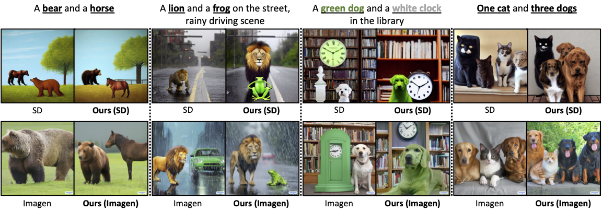
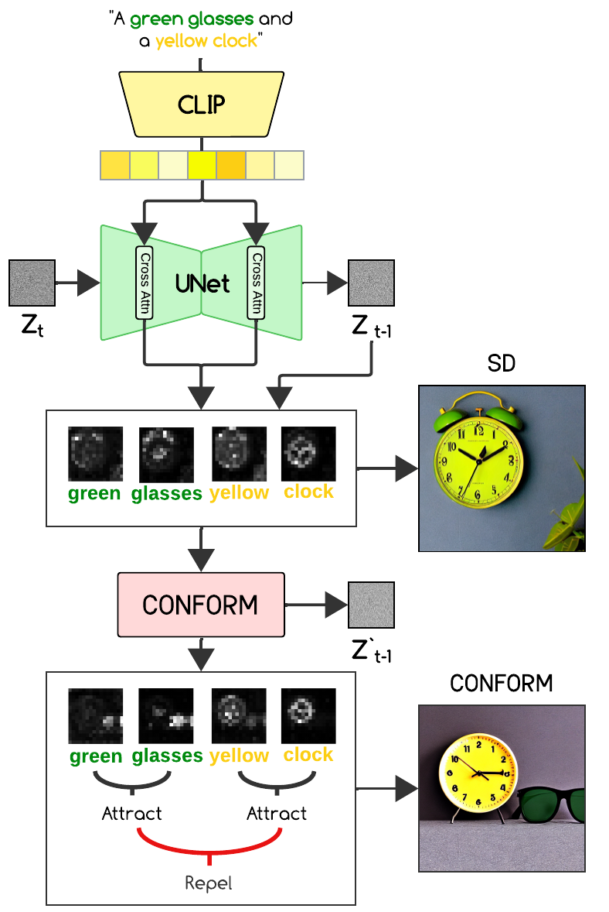
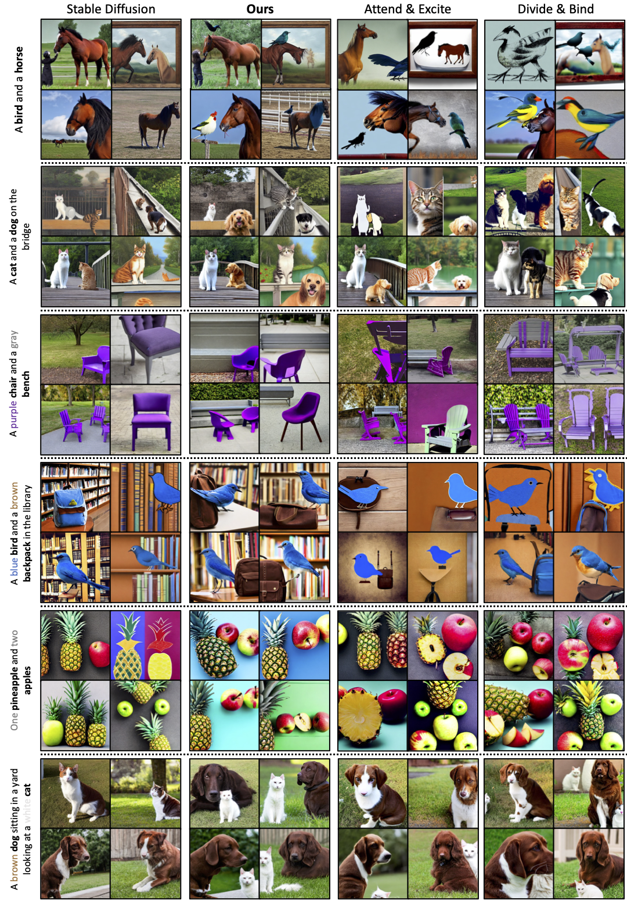

# **Improving Spatial Arrangement in CONFORM using Bounding Boxes**

[](https://conform-diffusion.github.io) [](https://arxiv.org/abs/2312.06059)


><p align="center">

>[Okan Çakır], [Özgür Temmuz Çelik], [Mahan Ahmadvand], [Kerem Güra]

></p>
>
> Text-to-image generation is an emerging topic in
Machine Learning and Natural Language Processing. One critical aspect of evaluating generated
images is the correct placement of objects according to the given prompt. This paper investigates
two models: Layout Predictor
and CONFORM (Meral et al., 2023). By combining the strengths of these models, we propose a
novel approach that improves object placement
accuracy in generated images of CONFORM. Preliminary results demonstrate that our model significantly improves alignment between textual descriptions and visual outputs.


<p align="center">
      
    <br>
    Our approach combines the strengths of the Layout Predictor and CONFORM. We generate the bounding boxes for each object in the prompt using the Layout Predictor for accurate spatial arrangements. Afterwards, we use these bounding boxes to accurately place objects within the frame. This novel solution allows us to solve the misplacement issue of objects in the original model of CONFORM.
</p>

## Description
Official implementation for our paper, CONFORM.

<p align="center">
      
<br>
An overview of CONFORM. Given a prompt (e.g., ‘A green glasses and a yellow clock’), we extract the subject tokens green, glasses, yellow, and clock and their corresponding attention maps (A<sup>green</sup>,A<sup>glasses</sup>, A<sup>yellow</sup>, A<sup>clock</sup>) from timesteps <i>t</i> and <i>t + 1</i>. We employ our contrastive objective at each time step to repel negative pairs and attract positive pairs.
</p>

## Setup

### Environment
To set up their environment, please run:
```
conda env create -f environment.yaml
conda activate conform
```

### Hugging Face Diffusers Library
Our code relies also on Hugging Face's [diffusers](https://github.com/huggingface/diffusers) library for downloading the Stable Diffusion v1.5 model. 


## Usage

<p align="center">
      
<br>
Example generations by Stable Diffusion, CONFORM, Attend & Excite, and Divide & Bind. 
</p>

To generate an image, you can use the jupyter notebook `notebook.ipynb`.

## Citation

If you find our work useful, please consider citing our paper:

```
@misc{meral2023conform,
    title={CONFORM: Contrast is All You Need For High-Fidelity Text-to-Image Diffusion Models},
    author={Tuna Han Salih Meral and Enis Simsar and Federico Tombari and Pinar Yanardag},
    year={2023},
    eprint={2312.06059},
    archivePrefix={arXiv},
    primaryClass={cs.CV}
}
```
